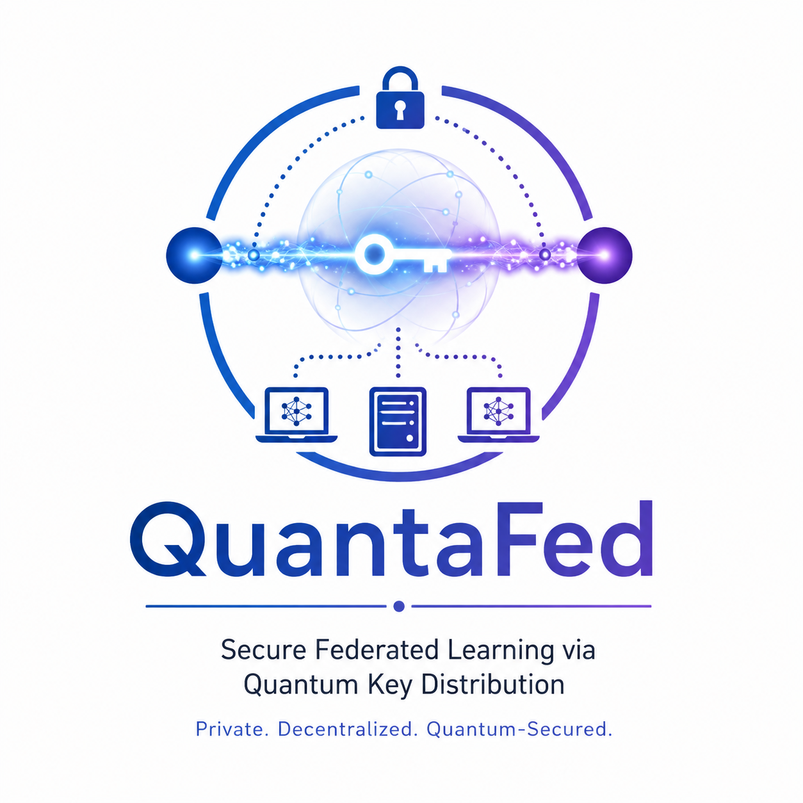

# ⚛️ QuantaFed

<p align="center">
  
</p>

<p align="center">
  <strong>Photonic Quantum Key Distribution for Secure Federated Learning</strong>
</p>

<p align="center">
  <em>Building a quantum-secure communication layer for privacy-preserving distributed artificial intelligence.</em>
</p>

<p align="center">

[]()
[]()
[]()
[]()
[]()
[](LICENSE)

</p>

<p align="center">
  <a href="#-about">About</a> •
  <a href="#-motivation">Motivation</a> •
  <a href="#-overview">Overview</a> •
  <a href="#-architecture">Architecture</a> •
  <a href="#-methodology">Methodology</a> •
  <a href="#-features">Features</a> •
  <a href="#-experiments">Experiments</a> •
  <a href="#-roadmap">Roadmap</a>
</p>

---

# 🌌 About

**QuantaFed** is a research-oriented framework at the intersection of **quantum communication**, **quantum cryptography**, **federated learning**, and **privacy-preserving artificial intelligence**.

The project investigates how **Photonic Quantum Key Distribution (QKD)** can be integrated into a **Federated Learning (FL)** architecture to strengthen the protection of communication between distributed participants.

Instead of moving sensitive datasets toward a central server, Federated Learning allows participating organizations or devices to train models locally and exchange model updates. QuantaFed adds a quantum communication perspective to this process by studying the use of QKD-generated shared keys for protecting communication channels.

The project is therefore built around a simple principle:

> **Keep the data distributed, secure the communication, and explore quantum technologies as an additional security layer.**

---

# 🎯 Motivation

Modern AI increasingly depends on data collected across multiple organizations, hospitals, laboratories, financial institutions, edge devices, and research centers.

However, centralizing such datasets can introduce major challenges:

- Data privacy concerns
- Regulatory restrictions
- Intellectual-property protection
- Communication security
- Centralized attack surfaces
- Trust between participating organizations

Federated Learning addresses part of this problem by keeping training data at the local participant.

However, the distributed architecture still requires communication between clients and coordinating servers.

This creates another important research question:

> **How can communication in federated AI systems be protected against increasingly sophisticated security threats?**

QuantaFed studies this question through the integration of **photonic QKD** and **secure federated learning**.

---

# ⚛️ Quantum + AI

QuantaFed brings together two rapidly developing areas:

```text
             QUANTUM COMMUNICATION
                       │
                       ▼
              ┌─────────────────┐
              │  Photonic QKD   │
              │                 │
              │ Quantum States  │
              │     ↓           │
              │ Secret Key       │
              └────────┬────────┘
                       │
                       ▼
                 SECURITY LAYER
                       │
                       ▼
              ┌─────────────────┐
              │   Encryption    │
              │ Authentication  │
              │ Key Management  │
              └────────┬────────┘
                       │
                       ▼
               FEDERATED AI
                       │
              ┌────────┴────────┐
              ▼                 ▼
        Local Training      Model Updates
              │                 │
              └────────┬────────┘
                       ▼
              Global Aggregation
                       │
                       ▼
                 Global Model


---

# ⭐ Support QuantaFed

<p align="center">
  <strong>If you find QuantaFed useful, interesting, or valuable for your research, please consider giving the repository a star.</strong>
</p>

<p align="center">

<a href="https://github.com/YOUR_USERNAME/QuantaFed/stargazers">
  
</a>

<a href="https://github.com/YOUR_USERNAME/QuantaFed/fork">
  
</a>

<a href="https://github.com/YOUR_USERNAME/QuantaFed/issues">
  
</a>

<a href="https://github.com/YOUR_USERNAME/QuantaFed/network/members">
  
</a>

</p>

### 🌟 Why Star?

A star helps the project:

- 📈 Increase visibility
- 🔬 Reach more researchers
- 🤝 Attract contributors
- 💡 Encourage further development
- 🌍 Connect the project with the quantum-security community

<p align="center">
  <a href="https://github.com/YOUR_USERNAME/QuantaFed">
    ⭐ <strong>Star QuantaFed on GitHub</strong> ⭐
  </a>
</p>

---

# 📊 Repository Statistics

<p align="center">


</p>
